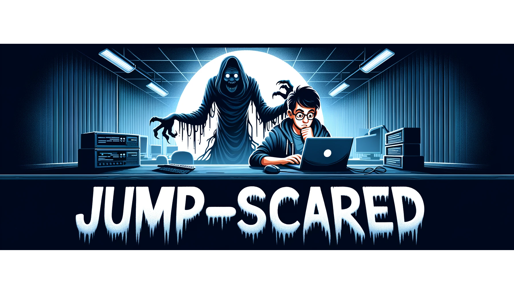

# Jump-Scared: Halloween Emotion Detection Project



Jump-Scared is a Halloween-themed project made for [Spooky Software Hackathon](https://spooky-software-hackathon.devpost.com/). Jump-Scared aims to surprise its users with a spooky twist! Using advanced emotion detection techniques, when a user maintains a "neutral" expression for over 15 seconds, the program plays a jump scare sound and locks their screen with a scary gif, giving them a good Halloween scare!

## Setup

1. Clone the repository:

```
git clone https://github.com/Sebastian-Alexis/Jump-Scared
cd Jump-Scared
```

2. Install the required Python packages:

```
pip install -r requirements.txt
```

3. Run the main script:

```
python3 main.py
```

## Usage

Simply run the `main.py` script and keep your face in the camera's view. Maintain a neutral expression for over 15 seconds and get ready to be jump-scared!
